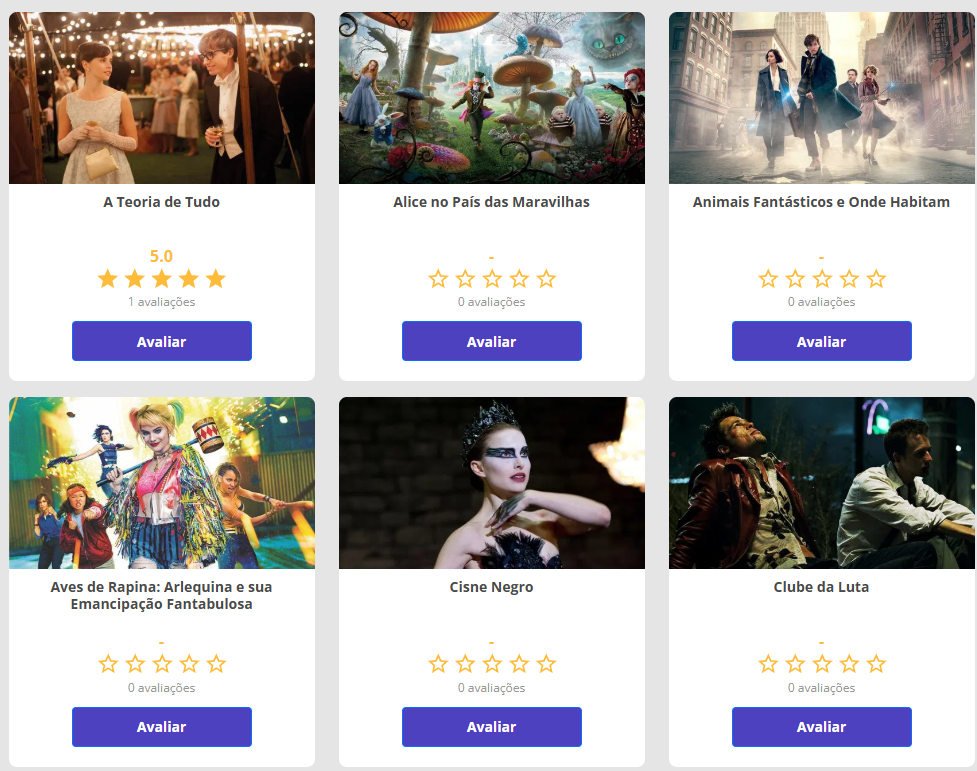

  

<h3 align="center">Site de catálogo de filmes </h3>

---

 Catálogo de filmes onde é possível fazer a sua avaliação
      

  <a href="https://renanvt.github.io/projeto-narutoshippuden/">https://renanvt-dsmovie.netlify.app/</a>

## 📝 Tabela de Conteúdos

- [Sobre](#about)
- [Primeiros Passos](#getting_started)
- [Deploy](#deployment)
- [Uso](#usage)
- [Construído com](#built_using)
- [Autores](#authors)
- [Agradecimentos](#acknowledgement)
- [Licença](#license)

## 🧐 Sobre 

Projeto pessoal complexo de um site de catálogo de filmes onde as pessoas dão nota para o filme e seus dados ficam armazenados em um banco de dados relacional

## 🏁 Primeiros Passos 

Essas instruções irão te ajudar a obter uma cópia do projeto funcionando na sua máquina local para fins de desenvolvimento e testes. 

## Documentação

[BackEnd](BackEnd.md)

[FrontEnd](FrontEnd.md)

### Pré-requisitos

Java JDK e JRE
Google Chrome Atualizado.

### Instalação

``
git clone https://github.com/Renanvt/projeto-login.git``

Front end:

``yarn install``

``yarn start``

---

Back end:

Instalar o Java SDK

Depois de ter intalado execute o comando

``java --version``

``javac -version``

Caso não consiga executar esses comandos, você precisa adicionar o Java como variável do sistema 

Vá em:

Painel de Controle → Sistema → Configurações Avançadas do Sistema → Variáveis de Ambiente

Em Variáveis de sistema, clique em Novo:

Nome da variável: **JAVA_HOME**

Valor da variável: C:\Program Files\Java\jdk-21 (ajuste conforme o seu caminho)

Ainda em Variáveis de sistema, edite a variável Path:

Adicione: **%JAVA_HOME%\bin**

Reinicie o terminal.

---

Dentro da pasta backend/dsmovie execute o comando
``./mvnw clean package``

``java -jar target/dsmovie-<versão>.jar``

## 🎈 Uso 

Utilize o **Githubdesktop** ou **Git Bash** para clonar no seu computador

## ⛏️ Construído com 

- [Html5](https://developer.mozilla.org/en-US/docs/Glossary/HTML5) - HTML5
- [Css](https://developer.mozilla.org/en-US/docs/Web/CSS/) - CSS
- [JavaScript](https://developer.mozilla.org/en-US/docs/Web/JavaScript) - JavaScript
- [NodeJs](https://nodejs.org/docs/latest/api/) - Ambiente de Execução do Servidor
- [SpringBoot](https://docs.spring.io/spring-boot/index.html) - Ambiente de Execução do Servidor

## ✍️ Autores 

- [@Renanvt](https://github.com/) - Ideia e trabalho inicial
- [DevSuperior](https://github.com/devsuperior) - Esboço do projeto

## 🎉 Agradecimentos 

- Agradecimento a todos que contribuíram com código utilizado
- Inspiração *Professor Nelio Alves*

## 📝 LICENÇA 

Licensed under Creative Commons Attribution 4.0 International (CC BY 4.0)

Copyright © 2025 [Renan Vitoriano](https://github.com/Renanvt)

Você pode usar, adaptar e compartilhar este projeto, desde que dê os devidos créditos aos autores.

Para mais informações, consulte o arquivo [LICENSE](LICENSE)

Projeto desenvolvido como prática pessoal com base nos ensinamentos da equipe [Dev Superior](https://devsuperior.com.br/).
